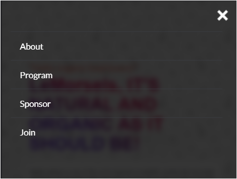

# LeMorsels

> This is my capstone project of module 1 in Microverse, the approach for this project is to put in practice all the skills we got through our first module, such as Set up linters, Git and the Github Flow, Flexbox and Grid, HTML/CSS and JS best practices to recreate a webpage from scratch using visual content/guidelines.

## Built With

- HTML
- CSS
- JS

## Live Demo (if available)

[Live Demo Link](https://fredsepht32.github.io/Fritzfirst-Capstone/)

## Video Presentation

[Capstone 1 video presentation](https://drive.google.com/file/d/14k4pLXp9SfEFt4HM4KiMU0u-EceIvGq2/view?usp=sharing)

## Getting Started

To get a local copy up and running follow these simple example steps.

### Prerequisites

- A Good Internet Service.
- Basic Knowledge about Git and Github.
- Use a Code Text editor.

## Setup

- Create an empty folder in your computer to store the clone.
- Click on the green code button and copy the link of the Repository
- https://github.com/FredsephT32/Set-Up-Mobile-Portfolio.git
- CLone the Repository in your Github Desktop or Git Bash.
- And Open the Folder In your Text Editor for example VSCode.

### Install

To install linters please open the ***.github/workflows*** then get into ***linters.yml*** and check the instructions and commands.

### Usage

For educational purpose only, use it as a guideline.

## Authors

👤 **Author Frederick**

- GitHub: [@FredsephT32](https://github.com/FredsephT32)
- Twitter: [@lil Fritz](https://twitter.com/Frederi70813362)
- LinkedIn: [@LinkedIn](https://www.linkedin.com/in/frederick-torres-900b4a196/)

## 🤝 Contributing

Contributions, issues, and feature requests are welcome!

Feel free to check the [issues page](../../issues/).

## Show your support

Give a 👌 if you like this project!

## Acknowledgments

- Special thanks to the autor of the original design [Cindy Shin](https://www.behance.net/gallery/29845175/CC-Global-Summit-2015), The Microverse team and my Coding partners through this module.

## Project Images

## 📝 License

This project is [MIT](./LICENSE) licensed.

_NOTE: we recommend using the [MIT license](https://choosealicense.com/licenses/mit/) - you can set it up quickly by [using templates available on GitHub](https://docs.github.com/en/communities/setting-up-your-project-for-healthy-contributions/adding-a-license-to-a-repository). You can also use [any other license](https://choosealicense.com/licenses/) if you wish._
